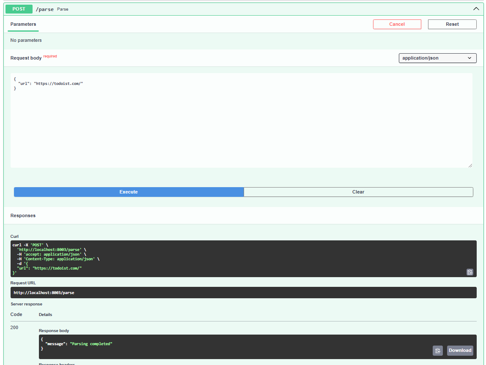

# Подзадача 1: Упаковка FastAPI приложения, базы данных и парсера данных в Docker

1. Создание FastAPI приложения: Создано в рамках лабораторной работы номер 1

2. Создание базы данных: Создано в рамках лабораторной работы номер 1

3. Создание парсера данных: Создано в рамках лабораторной работы номер 2
Парсер синхроннный, так как мне показалось логичным раз все приложение из лабораторной 1,
так написано, то не изменять традициям, тем более за скоростью здесь мы не гонимся.

4. Реализуйте возможность вызова парсера по http Для этого можно сделать отдельное приложение FastAPI для парсера или воспользоваться библиотекой socket или подобными.

```python
from fastapi import FastAPI, HTTPException, status
from pydantic import BaseModel
import requests

from src.parse_and_save import parse_and_save
from src.connection import init_db


app = FastAPI()

class ParseRequest(BaseModel):
    url: str

@app.on_event("startup")
def on_startup():
    init_db()

@app.post("/parse")
def parse(request: ParseRequest):
    try:
        response = requests.get(request.url)
        response.raise_for_status()
        parse_and_save(request.url)
        return {"message": "Parsing completed"}
    except requests.RequestException as e:
        raise HTTPException(status_code=status.HTTP_500_INTERNAL_SERVER_ERROR, detail=str(e))
```

5. Разработка Dockerfile:
Здесь я решил его не делать, так как мне удобнее создавать образы в docker-compose.

6. Создание Docker Compose файла:

```docker
services:
  postgres-web:
    image: postgres:latest
    container_name: postgres-web
    hostname: postgres
    ports:
      - "5432:5432"
    environment:
      POSTGRES_USER: ${POSTGRES_USER}
      POSTGRES_PASSWORD: ${POSTGRES_PASSWORD}
      POSTGRES_DB: ${POSTGRES_DB}
    volumes:
      - postgres-data:/var/lib/postgresql/data

  sheduler:
    image: python:3.12
    working_dir: /sheduler
    command: >
      sh -c "cp /tmp/sheduler/requirements.txt . &&
             pip install --no-cache-dir -r requirements.txt &&
             mkdir -p /sheduler/data /sheduler/logs &&
             uvicorn src.main:app --reload --workers 1 --host 0.0.0.0 --port 8000"
    environment:
      POSTGRES_USER: ${POSTGRES_USER}
      POSTGRES_PASSWORD: ${POSTGRES_PASSWORD}
      POSTGRES_DB: ${POSTGRES_DB}
      POSTGRES_HOST: postgres
    volumes:
      - ./sheduler/src/:/sheduler/src/
      - ./sheduler/requirements.txt:/tmp/sheduler/requirements.txt
    ports:
      - "8002:8000"
    depends_on:
      - postgres-web
      - parser

  parser:
    image: python:3.12
    working_dir: /parser
    command: >
      sh -c "cp /tmp/parser/requirements.txt . &&
             pip install --no-cache-dir -r requirements.txt &&
             mkdir -p /parser/data /parser/logs &&
             uvicorn src.main:app --reload --workers 1 --host 0.0.0.0 --port 8000"
    environment:
      POSTGRES_USER: ${POSTGRES_USER}
      POSTGRES_PASSWORD: ${POSTGRES_PASSWORD}
      POSTGRES_DB: ${POSTGRES_DB}
      POSTGRES_HOST: postgres
    volumes:
      - ./parser/src/:/parser/src/
      - ./parser/requirements.txt:/tmp/parser/requirements.txt
    ports:
      - "8003:8000"
    depends_on:
      - postgres-web

volumes:
  postgres-data:
```

## Результаты


