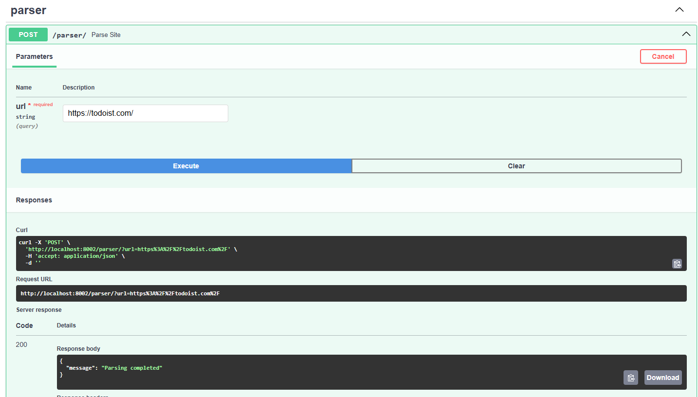

# Подзадача 3: Вызов парсера из FastAPI через очередь

Сначала надо установить Redis и Сelery

```bash
pip install redis celery
```

## Сelery config

Пишем конфиг для Сelery. Надо обязательно указать `include=['src.task']`, так как
иначе не может найти задачу, также надо указать для какого сервиса (sheduler).

```python
from celery import Celery


app = Celery('sheduler',
              broker='redis://redis:6379/0',
              backend='redis://redis:6379/0',
              include=['src.task'])

app.conf.update(
    result_expires=3600,
    task_serializer='json',
    accept_content=['application/json'],
    result_serializer='json',
    timezone='UTC',
    enable_utc=True,
)

if __name__ == '__main__':
    app.start()
```

## Сelery task

Пишем задачу Celery, для этого я просто вынес сюда логику запроса из обработчика.

```python
import requests

from src.celery_config import app


@app.task
def parse_url(url: str):
    response = requests.post("http://parser:8000/parse",
                             json={"url": url})
    response.raise_for_status()
    return response.json()
```

## Docker compose

Меняем `docker-compose.yml`. Захотелось указать сеть, чтобы бы было видно, что
все сервисы в одной сети. Добавил сервисы `celery-worker` и `redis`.

```docker
services:
  postgres-web:
    image: postgres:latest
    container_name: postgres-web
    hostname: postgres
    ports:
      - "5432:5432"
    environment:
      POSTGRES_USER: ${POSTGRES_USER}
      POSTGRES_PASSWORD: ${POSTGRES_PASSWORD}
      POSTGRES_DB: ${POSTGRES_DB}
    volumes:
      - postgres-data:/var/lib/postgresql/data
    networks:
      - sheduler-network

  redis:
    image: redis:latest
    container_name: redis
    ports:
      - "6379:6379"
    networks:
      - sheduler-network

  sheduler:
    image: python:3.12
    working_dir: /sheduler
    command: >
      sh -c "cp /tmp/sheduler/requirements.txt . &&
             pip install --no-cache-dir -r requirements.txt &&
             mkdir -p /sheduler/data /sheduler/logs &&
             uvicorn src.main:app --reload --workers 1 --host 0.0.0.0 --port 8000"
    environment:
      POSTGRES_USER: ${POSTGRES_USER}
      POSTGRES_PASSWORD: ${POSTGRES_PASSWORD}
      POSTGRES_DB: ${POSTGRES_DB}
      POSTGRES_HOST: postgres
      REDIS_HOST: redis
    volumes:
      - ./sheduler/src/:/sheduler/src/
      - ./sheduler/requirements.txt:/tmp/sheduler/requirements.txt
    ports:
      - "8002:8000"
    depends_on:
      - postgres-web
      - parser
      - redis
    networks:
      - sheduler-network

  parser:
    image: python:3.12
    working_dir: /parser
    command: >
      sh -c "cp /tmp/parser/requirements.txt . &&
             pip install --no-cache-dir -r requirements.txt &&
             mkdir -p /parser/data /parser/logs &&
             uvicorn src.main:app --reload --workers 1 --host 0.0.0.0 --port 8000"
    environment:
      POSTGRES_USER: ${POSTGRES_USER}
      POSTGRES_PASSWORD: ${POSTGRES_PASSWORD}
      POSTGRES_DB: ${POSTGRES_DB}
      POSTGRES_HOST: postgres
    volumes:
      - ./parser/src/:/parser/src/
      - ./parser/requirements.txt:/tmp/parser/requirements.txt
    ports:
      - "8003:8000"
    depends_on:
      - postgres-web
    networks:
      - sheduler-network

  celery-worker:
    image: python:3.12
    working_dir: /sheduler
    command: >
      sh -c "cp /tmp/sheduler/requirements.txt . &&
             pip install --no-cache-dir -r requirements.txt &&
             celery -A src.celery_config worker --loglevel=info"
    environment:
      POSTGRES_USER: ${POSTGRES_USER}
      POSTGRES_PASSWORD: ${POSTGRES_PASSWORD}
      POSTGRES_DB: ${POSTGRES_DB}
      POSTGRES_HOST: postgres
      REDIS_HOST: redis
    volumes:
      - ./sheduler/src/:/sheduler/src/
      - ./sheduler/requirements.txt:/tmp/sheduler/requirements.txt
    depends_on:
      - redis
      - postgres-web
    networks:
      - sheduler-network

networks:
  sheduler-network:

volumes:
  postgres-data:
```

## Parser endpoint

Переписываем обработчик на асинхронный. Тут стоит заметить, что я немного неправильно поступил
и отошел от задания, но мне хотелось видеть результат выводящийся, а еще один эндпоинт
писать я не хотел. У меня получилось, что вместо возвращения в ответ task.id, ожидает
выполнения и потом возвращает результат, но в силу асинхронности возможно все не так плохо.

```python
from fastapi import APIRouter, HTTPException, status
from celery.result import AsyncResult
from asyncio import sleep

from src.task import parse_url


router = APIRouter(prefix="/parser", tags=["parser"])


@router.post("/")
async def parse_site(url: str):
    try:
        task = parse_url.apply_async((url,))
        result = AsyncResult(task.id)

        # Не хочу писать еще один эндпоинт который показывает статус
        # таски, поэтому пусть таска поспит пока не подойдет ее очередь
        while not result.ready():
            await sleep(1)

        if not result.successful():
            raise HTTPException(status_code=status.HTTP_500_INTERNAL_SERVER_ERROR, detail=result.result)
        
        return result.result
    except Exception as e:
        raise HTTPException(status_code=status.HTTP_500_INTERNAL_SERVER_ERROR, detail=str(e))
```

## Результаты

Запрос на shedule



Что показывает в этот момент docker-compose


## Вывод

Самым полезным я считаю это сети внутри docker compose, а если точнее возможность обращаться
не по какому-то замысловатому хосту, и Celery, так как он дает возможность распределить нагрузку,
что помогает улучшить производительность приложения.
